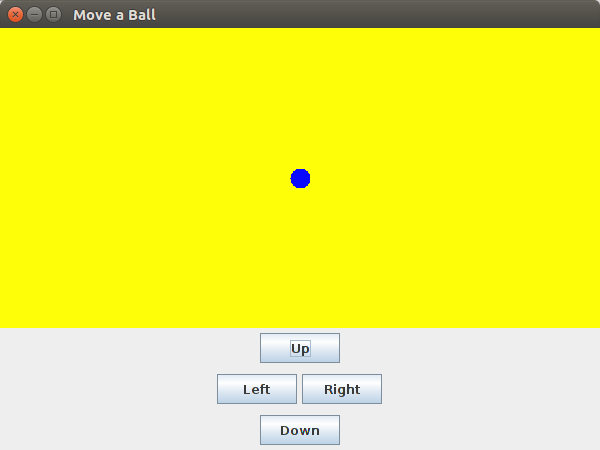
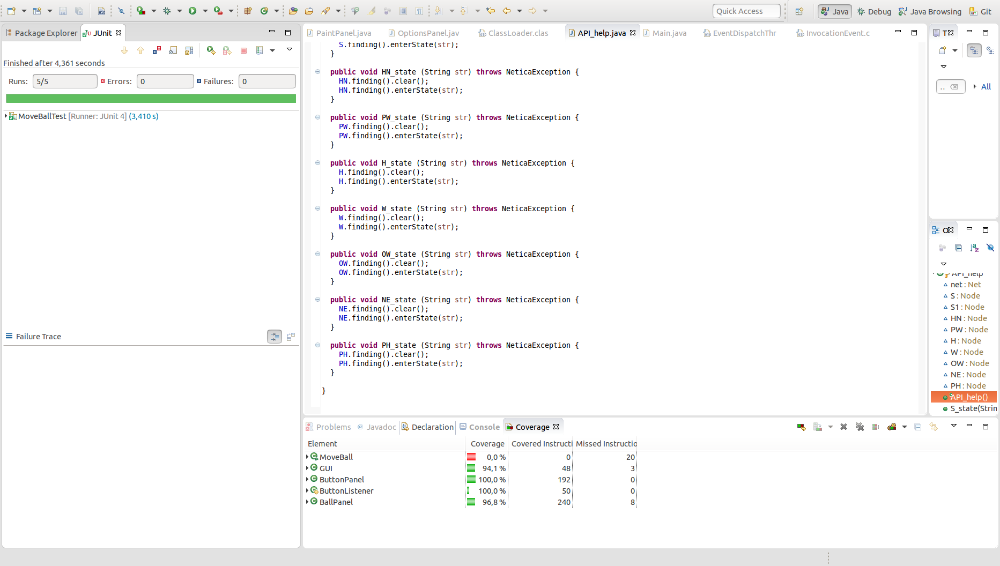

# Práctica 8, Programación de Aplicaciones Interactivas. Movimiento y control de un objeto gráfico.
#Movement and control of a graphic object.

Programa que muestra en pantalla un panel gráfico que contiene una bola en el centro al ser ejecutado, el movimiento de la bola es controlado por el usuario mediante el uso de 4 botones situados en la parte inferior de la pantalla.

Program that shows a graphic panel with a blue ball in the middle, the ball can be controlled by the user with the four buttons at the bottom of the screen

El programa se ha realizado empleando diseño dirigido por comportamiento, haciendo uso de AssertJ, JUnit y JaCoCo.

The program has been developed using BDD (behavioral driven development), using AssertJ, JUnit and JaCoCo.
